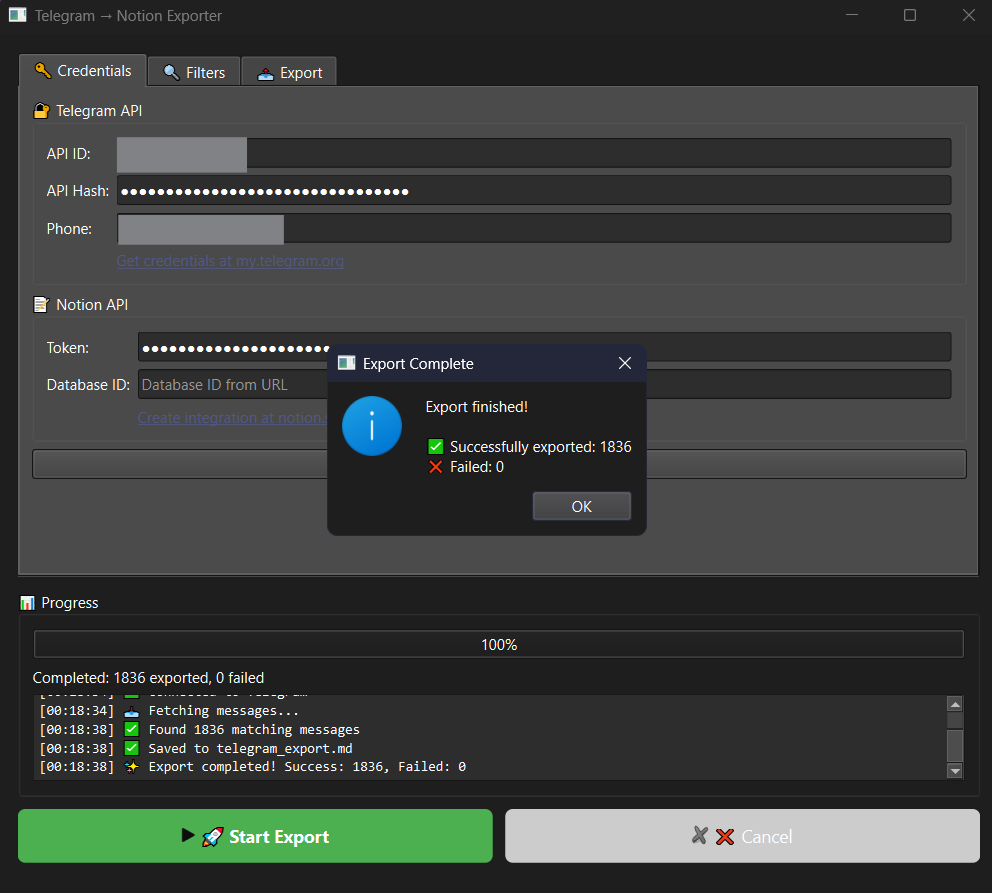
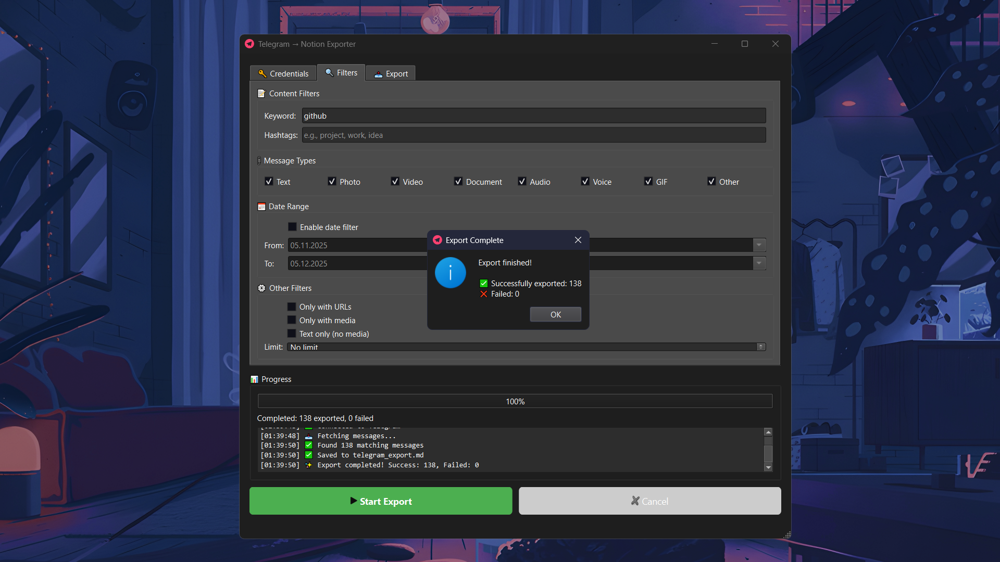

# Telegram → Notion Exporter

Export your Telegram Saved Messages to Notion database or local files (JSON, CSV, Markdown).


If you, like me, use Telegram Saved Messages as a notebook, this tool makes it easy to pull your notes down to your computer for safe keeping or further processing.

## Features

- **Export to Notion** — Create pages in your Notion database with full message content
- **Multiple Export Formats** — JSON, CSV, Markdown file exports
- **Powerful Filtering**:
  - Filter by keywords (with regex support, e.g., `python|javascript`)
  - Filter by hashtags
  - Filter by message type (Text, Photo, Video, Document, Audio, Voice, GIF, etc.)
  - Filter by date range
  - Limit number of messages
- **Two Interfaces**:
  - **GUI Application** — User-friendly desktop app (Windows/Mac/Linux)
- **CLI Script** — Command-line interface for automation and scripting
- **Secure Authentication** — Supports Telegram 2FA (two-factor authentication)
- **Session Persistence** — Login once, export multiple times

## Download ready builds

> Always use the artifact that matches your platform.

- **Windows (.zip)**  
  [Download latest](https://github.com/ruslanlap/Telegram-SavedMessages-Export/releases/latest/download/TelegramNotionExporter-Windows.zip)  
  1) Unzip  2) Run `TelegramNotionExporter.exe`

- **Linux (.tar.gz)**  
  [Download latest](https://github.com/ruslanlap/Telegram-SavedMessages-Export/releases/latest/download/TelegramNotionExporter-Linux.tar.gz)  
  ```bash
  tar -xzf TelegramNotionExporter-Linux.tar.gz
  cd release
  chmod +x TelegramNotionExporter
  ./TelegramNotionExporter
  ```

- **macOS (.tar.gz)**  
  [Download latest](https://github.com/ruslanlap/Telegram-SavedMessages-Export/releases/latest/download/TelegramNotionExporter-macOS.tar.gz)  
  ```bash
  tar -xzf TelegramNotionExporter-macOS.tar.gz
  cd release
  chmod +x TelegramNotionExporter
  ./TelegramNotionExporter
  ```

### Using the downloaded app
1. Open the app (run the executable for your platform).
2. **Credentials tab:** enter Telegram API ID, API Hash, and your phone number; enter Notion Token and Database ID (for Notion export).
3. **Filters tab:** optional filters (keywords, hashtags, types, dates).
4. **Export tab:** choose destination (Notion / JSON / CSV / Markdown) and file path if exporting to file.
5. Click **Start Export** → enter the Telegram code and 2FA password if requested.

## Screenshots





The GUI provides a tabbed interface with:
- **Credentials Tab** — Enter Telegram API and Notion credentials
- **Filters Tab** — Configure message filters
- **Export Tab** — Choose export format and destination

## Installation

### Prerequisites

- Python 3.10 or higher
- Telegram API credentials from [my.telegram.org](https://my.telegram.org/apps)
- Notion Integration Token from [notion.so/my-integrations](https://www.notion.so/my-integrations) (for Notion export)

### Setup

1. **Clone the repository**
   ```bash
   git clone https://github.com/yourusername/telegram-notion-exporter.git
   cd telegram-notion-exporter
   ```

2. **Create virtual environment**
   ```bash
   python -m venv .venv
   source .venv/bin/activate  # Linux/Mac
   # or
   .venv\Scripts\activate     # Windows
   ```

3. **Install dependencies**
   ```bash
   pip install -r requirements.txt
   ```

## Configuration

### Getting Telegram API Credentials

1. Go to [my.telegram.org](https://my.telegram.org/apps)
2. Log in with your phone number
3. Create a new application
4. Copy the **API ID** and **API Hash**

### Getting Notion Credentials

1. Go to [notion.so/my-integrations](https://www.notion.so/my-integrations)
2. Create a new integration
3. Copy the **Internal Integration Token**
4. Create a database in Notion with these properties:
   - **Name** (title)
   - **Type** (select) — Options: Text, Photo, Video, Document, Audio, Voice, GIF, Sticker, Poll, Location, Contact, Other
   - **Date** (date)
   - **Message ID** (number)
   - **Tags** (multi-select)
   - **URL** (url)
5. Share the database with your integration
6. Copy the **Database ID** from the database URL

### Environment Variables (CLI only)

For the CLI script, create a `.env` file:

```env
TELEGRAM_API_ID=your_api_id
TELEGRAM_API_HASH=your_api_hash
TELEGRAM_PHONE=+1234567890
NOTION_TOKEN=your_notion_token
NOTION_DATABASE_ID=your_database_id
```

## Usage

### GUI Application

```bash
python telegram_notion_gui.py
```

1. Enter your credentials in the **Credentials** tab
2. Configure filters in the **Filters** tab (optional)
3. Select export format in the **Export** tab
4. Click **Start Export**
5. Enter the confirmation code sent to your Telegram
6. Enter 2FA password if enabled

### CLI Script

```bash
# Export all messages
python telegram_to_notion.py

# Export with filters
python telegram_to_notion.py --word github
python telegram_to_notion.py --word "python|javascript"
python telegram_to_notion.py --hashtag project work
python telegram_to_notion.py --type Photo Video
python telegram_to_notion.py --days 7
python telegram_to_notion.py --limit 50
python telegram_to_notion.py --has-url

# Preview without exporting
python telegram_to_notion.py --dry-run

# Save to text file
python telegram_to_notion.py --save exported_messages.txt

# Combine filters
python telegram_to_notion.py --word github --type Text --limit 100 --days 30
```

#### CLI Options

| Option | Description |
|--------|-------------|
| `--word`, `-w` | Filter by keyword (supports regex with `\|` for OR) |
| `--hashtag`, `-t` | Filter by hashtag(s) |
| `--type` | Filter by message type(s) |
| `--days` | Export messages from last N days |
| `--after` | Export messages after date (YYYY-MM-DD) |
| `--before` | Export messages before date (YYYY-MM-DD) |
| `--has-url` | Only messages containing URLs |
| `--has-media` | Only messages with media |
| `--no-media` | Only text messages |
| `--limit`, `-l` | Maximum number of messages |
| `--skip` | Skip first N messages |
| `--save`, `-s` | Save to text file |
| `--dry-run` | Preview without exporting |
| `--yes`, `-y` | Skip confirmation prompt |
| `--verbose`, `-v` | Show detailed output |

### Pre-Authentication (Optional)

For headless environments or to avoid entering credentials each time:

```bash
python telegram_auth.py
```

This creates a session file that persists your Telegram login.

## Building Standalone Executable

Create a standalone Windows executable:

```bash
pip install pyinstaller
python build_exe.py
```

The executable will be created in `dist/TelegramNotionExporter.exe`.

## Project Structure

```
telegram-notion-exporter/
├── telegram_notion_gui.py    # GUI application (PyQt6)
├── telegram_to_notion.py     # CLI script
├── telegram_auth.py          # Authentication helper
├── build_exe.py              # PyInstaller build script
├── requirements.txt          # Python dependencies
├── .env                      # Environment variables (create this)
├── .gitignore
└── README.md
```

## Dependencies

- **pyrogram** — Telegram MTProto API client
- **tgcrypto** — Cryptography for Pyrogram
- **notion-client** — Official Notion API client
- **PyQt6** — GUI framework
- **python-dotenv** — Environment variable management
- **pyinstaller** — Executable builder (optional)

## Troubleshooting

### "Session file not found" error
Run `python telegram_auth.py` first to create a session file.

### "Invalid API credentials" error
Double-check your API ID and Hash from [my.telegram.org](https://my.telegram.org/apps).

### "Database not found" error
1. Ensure the database ID is correct (from the URL)
2. Make sure you've shared the database with your Notion integration

### 2FA not working
The app supports 2FA. When prompted, enter your cloud password (not the code from Telegram).

### Icons showing as squares (GUI)
This is a font rendering issue on some systems. The functionality is not affected.

## License

MIT License — feel free to use and modify.

## Author

Ruslan

## Contributing

Contributions are welcome! Please feel free to submit a Pull Request.
